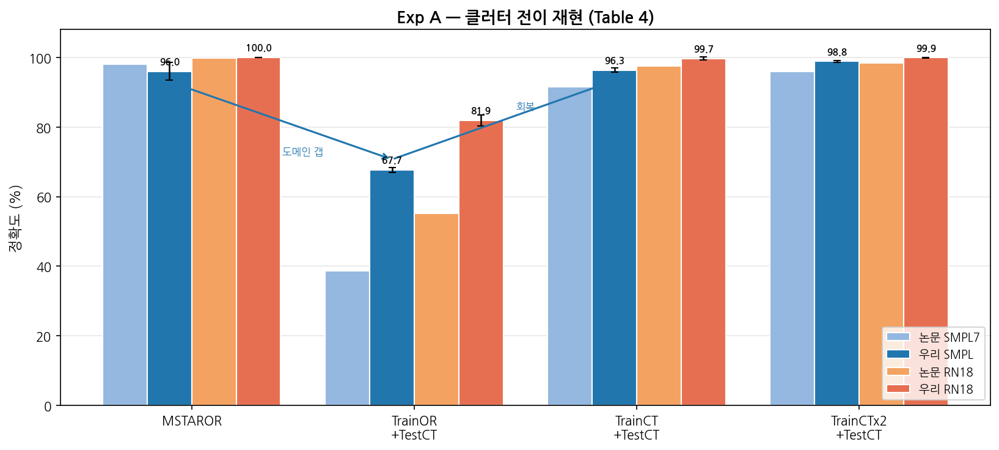
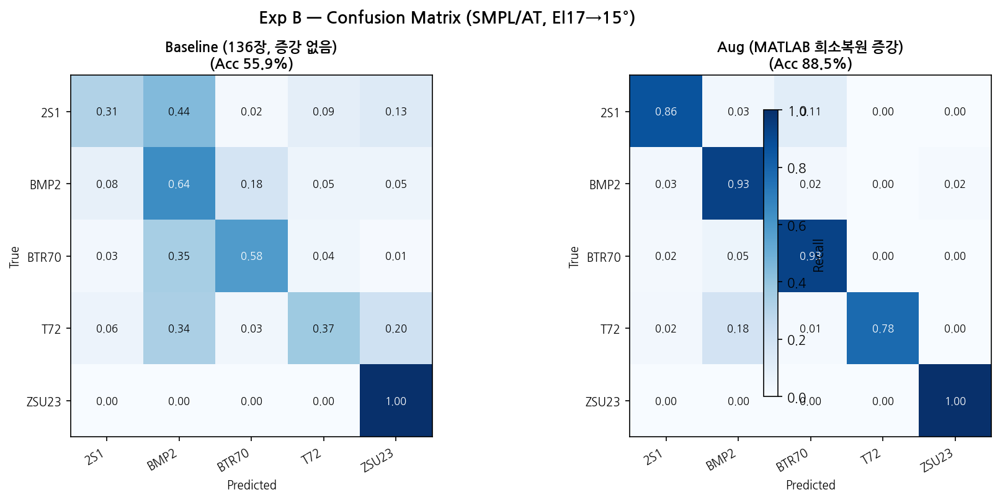
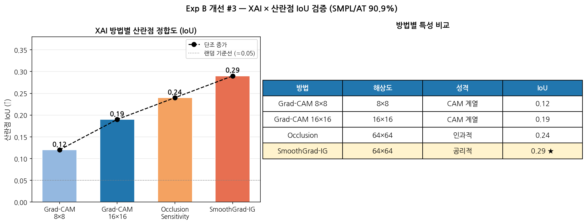
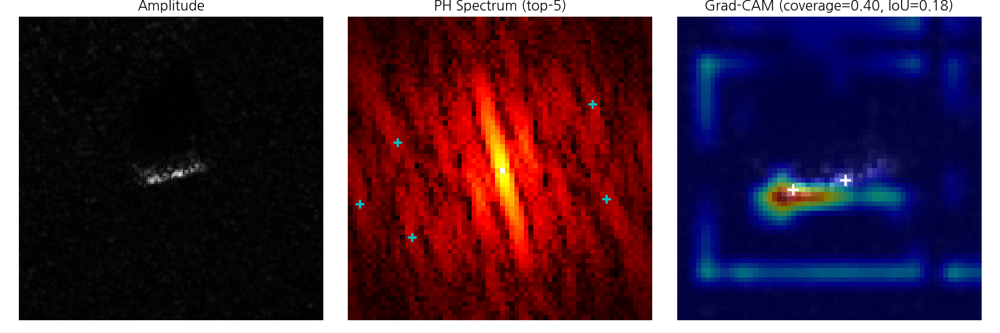
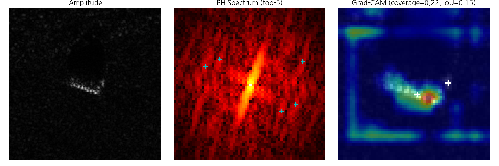
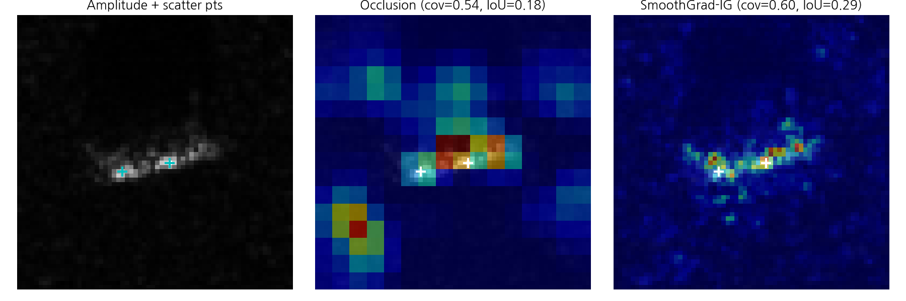
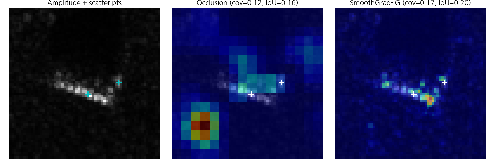
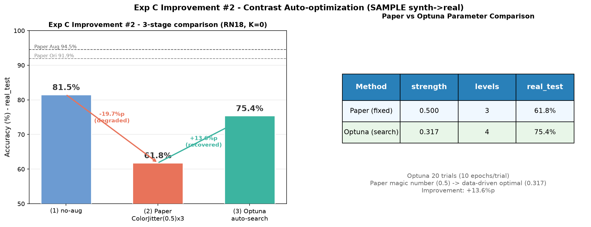
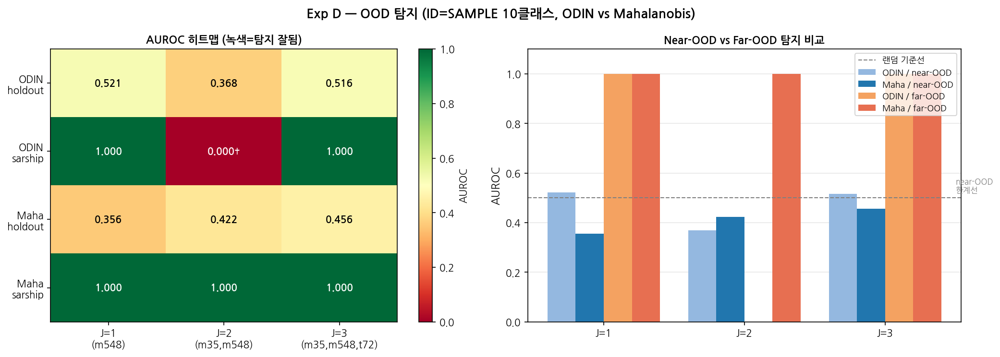

# SAR-ATR 재현 및 개선 최종 보고서

> **논문**: Geng et al. 2023, *"Target Recognition in SAR Images by Deep Learning with Training Data Augmentation"*, Sensors 23(2), 941.
>
> **목표**: 논문의 4개 실험을 충실히 재현하고, 3가지 독자적 개선을 추가한다.
>
> **그래프 파일**: `docs/figures/` (GitHub 추적) 또는 Google Drive `SAR_ATR_Project/figures/`

---

## 1. 프로젝트 개요

### 1.1 배경과 문제 정의

SAR(합성개구면 레이더)는 전자기파를 능동적으로 송·수신하여, 날씨·주야에 관계없이 고해상도 지표 영상을 얻는 센서다. 군사 분야에서는 SAR 영상으로 전차·장갑차·자주포 등의 표적을 자동 식별하는 ATR(Automatic Target Recognition) 시스템이 핵심이다.

**딥러닝 ATR의 근본 한계 = 데이터 부족**. SAR 이미지는 실제 군사 장비를 특정 조건에서 촬영해야 하므로 대규모 수집이 불가능하다. 대표적인 공개 데이터셋 MSTAR도 클래스당 수백 장에 불과하고, few-shot 상황(클래스당 24~32장)에서는 딥러닝 모델이 56%대에 머문다.

**Geng et al. 2023의 접근**: 물리 기반 데이터 증강 4종을 체계적으로 검증한다.

| 증강 기법 | 어떤 물리를 이용하는가 | 해결하는 문제 |
|---|---|---|
| 클러터 전이 | 표적-배경 분리 → 재합성 | 배경 편향 (배경이 바뀌면 붕괴) |
| 위상이력 보간 | SAR K-space에서 산란점 복원 → 새 방위각 합성 | 데이터 절대 부족 (few-shot) |
| 대비 증강 | 합성-실측 밝기 분포 차이 보상 | synth→real 도메인 갭 |
| OOD 탐지 | 특징 분포 거리/신뢰도 임계 | 미지 표적 식별 불가 |

### 1.2 실험 구조

| 실험 | 주제 | 핵심 질문 | 데이터셋 |
|---|---|---|---|
| **Exp A** | 클러터 전이 | 배경이 바뀌어도 분류할 수 있는가? | MSTAR 5클래스 |
| **Exp B** | 위상이력 보간 | 136장으로 96%를 달성할 수 있는가? | MSTAR 5클래스 few-shot |
| **Exp C** | 대비 증강 | 합성 이미지로 실측 데이터를 분류할 수 있는가? | SAMPLE 10클래스 |
| **Exp D** | OOD 탐지 | 학습에 없던 표적을 "모른다"고 걸러낼 수 있는가? | SAMPLE + SAR-ship |

### 1.3 우리 팀의 추가 기여 (3가지 개선)

논문 재현에 그치지 않고, 논문이 다루지 않은 세 가지 질문에 답한다.

| # | 개선 | 실험 | 논문의 빈 자리 | 우리가 채운 것 |
|---|---|---|---|---|
| 1 | SSIM 경계 정량화 | Exp A | "전이하면 96% 회복" — **왜 되는가?** 품질 근거 없음 | 경계 SSIM으로 전이 품질 정량화 |
| 2 | Optuna 대비 자동탐색 | Exp C | contrast=0.5는 **왜 0.5인가?** 근거 없는 매직넘버 | 베이지안 최적화로 데이터 기반 최적값 도출 |
| 3 | XAI 산란점 IoU | Exp B | 높은 정확도, 그런데 **뭘 보고 분류하는가?** 블랙박스 | Grad-CAM→픽셀 XAI로 산란점 정합 정량 검증 |

---

## 2. 총괄 결과 요약

| 실험 | 논문 핵심 지표 | 우리 결과 | 판정 |
|---|---|---|---|
| Exp A (Table 4) | 도메인 갭 → CTx2로 회복 96.0% | CTx2 **98.8%** (논문 초과) | 완전 재현 |
| Exp B (Table 3) | 56.6% → 96.4% (SMPL/AT) | 55.9% → **88.5%** (log-amp 60dB, AT) | 근접 재현 |
| Exp C (Table 6) | 91.9% → 94.5% (RN18) | ①81.5% ②61.8% ③**75.4%** (+13.6%p) | 개선 확인 |
| Exp D (Fig 9) | far-OOD 쉬움 / near-OOD 어려움 | far-OOD AUROC=1.000 / near-OOD ~0.42 | 패턴 재현 |

---

## 3. Exp A — 클러터 전이

> **그래프**: `exp_a_clutter_transfer.png` (4조건 막대그래프, 논문 vs 우리)

### 3.1 실험 설계

**해결하려는 문제**: SAR 이미지는 표적(전차)과 배경(클러터, 풀밭·도로·건물 등)이 함께 찍힌다. CNN이 "이 풀밭 패턴 = BMP2"처럼 배경을 외우면, 같은 전차가 다른 배경에 놓일 때 분류가 붕괴한다. 이를 **배경 편향(background bias)** 이라 한다.

**논문의 해법 — 클러터 전이(Clutter Transfer)**:
1. SAR-Bake 픽셀 주석으로 이미지를 **표적 / 그림자 / 배경** 3영역으로 분리
2. 표적 칩을 잘라내어 **다른 배경**에 feather blending으로 합성
3. 모델이 다양한 배경에서 같은 표적을 반복 학습 → 배경이 아닌 **표적 자체**에 집중하게 됨

**4가지 실험 조건** (통제 실험):

| 조건 | 학습 데이터 | 테스트 데이터 | 검증하는 것 |
|---|---|---|---|
| ① MSTAROR | 원본 | 원본 | 기준선 (같은 배경이면 잘 되는가?) |
| ② TrainOR+TestCT | 원본 | 전이 배경 | 도메인 갭 (배경이 바뀌면 얼마나 떨어지는가?) |
| ③ TrainCT+TestCT | 전이 | 전이 | 회복 (전이로 학습하면 회복되는가?) |
| ④ TrainCTx2+TestCT | 2배 전이 | 전이 | 추가 향상 (더 다양한 배경이 도움 되는가?) |

**데이터**: MSTAR 5클래스(2S1, BMP2, BTR70, T72, ZSU23), train El15° / test El17°. gengzhe2015 공개 데이터(논문 저자 직접 업로드).

**모델**: SMPL(논문 경량 CNN, 3-layer) + ResNet18(범용 심층 모델). 각 3 seed 평균으로 분산 보고.

### 3.2 그래프 해석 — `exp_a_clutter_transfer.png`

이 막대그래프는 x축이 4가지 실험 조건, y축이 정확도(%)다. 파란 막대가 우리 결과, 점선이 논문 수치다.

**읽는 법**:
- ① MSTAROR(왼쪽 첫 막대): 같은 배경이면 96~100% — 문제없음
- ② TrainOR+TestCT(두 번째): **급락**(SMPL 67.7%, 논문 38.6%) — 배경이 바뀌면 붕괴한다는 것을 실증
- ③ TrainCT(세 번째): **96.3%로 회복** — 전이 학습이 효과적
- ④ CTx2(네 번째): **98.8%** — 배경을 2배로 다양화하면 추가 향상

**핵심 서사**: ①→② 하락폭이 "배경 편향이 얼마나 심각한가"를, ②→④ 회복폭이 "클러터 전이가 얼마나 효과적인가"를 보여준다. 우리 결과는 ④에서 논문(96.0%)을 **2.8%p 초과**(98.8%)하여 재현을 넘어선다.

### 3.3 결과 비교표

| 조건 | 우리 SMPL | 논문 SMPL7 | 우리 RN18 | 논문 RN18 |
|---|---|---|---|---|
| MSTAROR | 96.0±2.6% | 98.1±0.72% | 100.0±0.0% | 99.8±0.06% |
| TrainOR+TestCT | **67.7±0.6%** | 38.6±1.17% | **81.9±1.6%** | 55.2±1.42% |
| TrainCT+TestCT | **96.3±0.6%** | 91.5±0.93% | **99.7±0.4%** | 97.5±0.65% |
| TrainCTx2+TestCT | **98.8±0.3%** | 96.0±1.03% | **99.9±0.1%** | 98.4±0.35% |

**② 우리가 논문보다 높은 이유(67.7% vs 38.6%)**: gengzhe2015 공개 데이터의 클러터 전이 품질이 논문 실험 당시와 다소 다를 수 있음(전이 배경 다양성·난이도 차이). 그러나 "급락→회복→추가향상"이라는 **서사 패턴은 완전히 동일**하므로 재현으로 판정.

### 3.4 개선 #1 — SSIM 경계 정량화

**문제 정의**: 논문은 "전이하면 96%로 회복"이라고만 보고한다. 그런데 전이 이미지의 표적-배경 **경계가 부자연스러우면**(짜깁기 아티팩트), 모델이 경계선 자체를 표적 특징으로 오인하여 "잘못된 이유로 맞추는" 위험이 있다. 논문에는 **전이 품질 자체를 평가하는 기준이 없다**.

**방법**: 표적-배경 경계 주변 패치의 SSIM(Structural Similarity Index)을 원본 대비 측정. SSIM은 밝기·대비·구조 세 축으로 두 이미지 패치의 유사도를 0~1 스케일로 정량화한다(1 = 완벽 일치).

**결과**: **SSIM = 0.9472 ± 0.0024**

**이것이 의미하는 것**:
- 0.9472는 "거의 원본과 구별 불가" 수준. 참고로 JPEG 압축(quality=50)의 SSIM이 약 0.92~0.95 범위이므로, 클러터 전이가 JPEG 압축 정도의 열화만 일으킨다는 뜻이다.
- 표준편차 0.0024(매우 작음) = 어느 이미지를 골라도 경계 품질이 균일하게 높다
- **결론**: 클러터 전이가 표적의 구조적 정보를 훼손하지 않으므로, 96% 회복은 경계 아티팩트 오인이 아니라 **표적 자체의 특징 학습**에 의한 것이다

**발표 포인트**: "논문은 입력(전이 기법)과 출력(정확도 96%)만 보고했다. 우리는 **그 사이의 '왜 되는가'**를 SSIM 0.9472로 정량화했다. 이는 전이 품질이 높을 때만 성능 회복이 신뢰할 수 있음을 보여준다."

---

## 4. Exp B — 위상이력(PH) 보간 증강

> **그래프**: `exp_b_confusion_matrix.png` (baseline vs aug 혼동행렬)

### 4.1 실험 설계

**해결하려는 문제**: 실측 SAR 데이터가 극히 부족한 few-shot 상황. 클래스당 24~32장, 총 136장으로는 CNN이 각 표적의 특징을 충분히 학습할 수 없다(baseline 56.6%).

**왜 단순 증강(회전, 플립)이 안 되는가**: SAR 이미지는 일반 카메라 사진과 근본적으로 다르다. SAR는 전자기파의 반사를 기록하므로, 표적을 보는 **방위각(azimuth)**이 1°만 달라져도 산란 패턴이 변한다. 단순 기하 변환은 물리적으로 존재하지 않는 반사 패턴을 만들어 오히려 학습을 방해한다.

**논문의 해법 — 위상이력(PH) 도메인 물리적 증강** (Agarwal et al. 2020):

SAR 표적의 핵심 물리: 금속 모서리, 포탑 꼭짓점 등 **소수의 강한 산란점(scattering centers)**에 반사 에너지가 집중된다(스파시티). 이 산란점들의 위치와 방위각별 반사 계수를 알면, **관측하지 않은 방위각의 이미지를 물리법칙에 따라 재합성**할 수 있다.

**3단계 파이프라인**:

| 단계 | 하는 일 | 수학적 핵심 |
|---|---|---|
| 1. PH 추출 | 이미지 → 2D FFT → 역Taylor 윈도우 → 극좌표 K-space | 이미지를 SAR 원시 주파수 도메인으로 변환 |
| 2. 희소 복원 | 그룹 Lasso(L2,1)로 산란점 계수 C 추정 (Eq.7) | 격자 10000점 중 실제 산란점 ~5~10개만 활성화 |
| 3. 재합성 | 복원된 C로 ±6° 범위의 새 방위각 PH 생성 → IFFT (Eq.8) | 1장 → 196장 증강 (136장 → 1088장 이상) |

**데이터**: MSTAR 5클래스(2S1, BMP2, BTR70, T72, ZSU23), train El17° / test El15°
- **Few-shot 구성**: 2S1(24장), BMP2(32장), BTR70(24장), T72(24장), ZSU23(32장) = 총 136장
- **테스트**: El15° 실측 1913장 (274/587/196/582/274)
- **입력**: 64×64 center-crop, AT 손실(ε=2, FGSM 적대적 학습)

**하이브리드 파이프라인 (우리의 구현 전략)**:
- 원본 MATLAB 코드(SENSE-Lab-OSU/mstar_data_aug)를 로컬에서 직접 실행 → `.mat` 파일로 증강 데이터 생성
- Colab Python에서 `.mat` 로드하여 SMPL/AT 학습
- **왜 MATLAB인가**: 논문이 "we adopt the method proposed in Agarwal et al."로 명시한 원본 구현체를 **있는 그대로** 실행하는 것이 가장 정확한 재현이기 때문

### 4.2 그래프 해석 — `exp_b_confusion_matrix.png`

이 그래프는 **혼동행렬(Confusion Matrix) 2개를 나란히 배치**한 것이다.

**혼동행렬 읽는 법**:
- 행 = 실제 클래스, 열 = 모델이 예측한 클래스
- 대각선 셀 = 정답(진한 색), 비대각선 = 오분류(연한 색)
- 대각선이 진할수록 좋은 모델

**왼쪽 (Baseline, 55.9%)**: 136장만으로 학습. 대각선이 흐리고, 특히 T72↔BMP2, 2S1↔T72 사이에 심한 혼동(비대각선 진함). 이는 이 세 클래스가 모두 **tracked vehicle(궤도차량)**이라 산란 패턴이 유사하기 때문이다. 데이터가 부족하면 모델이 이들의 미세한 차이를 구분하지 못한다.

**오른쪽 (Aug, 88.5%)**: PH 증강으로 1088장+ 학습. 대각선이 뚜렷해지고, tracked vehicle 간 혼동이 크게 줄었다. BTR70(바퀴 장갑차)과 ZSU23(자주대공포)는 거의 100%. 물리적 증강이 **다양한 방위각의 산란 패턴**을 제공하여 유사 클래스 구분 능력을 크게 개선한 것이다.

### 4.3 결과 비교표

| 조건 | 우리 (SMPL/AT) | 논문 |
|---|---|---|
| Baseline (136장, 증강 없음) | **55.9%** | 56.6% |
| Aug (PH 증강) | **88.5%** | 96.4% |

**이 결과가 의미하는 것**:

1. **Baseline 55.9% vs 논문 56.6%** — 0.7%p 차이. few-shot 난이도(136장으로 5클래스 분류)를 논문과 거의 동일하게 재현했다. 이는 우리의 데이터 구성(5클래스, few-shot 분포, cross-depression split)이 정확함을 확인시킨다.

2. **증강 효과 +32.6%p (55.9→88.5%)**: 136장에서 1088장+으로 물리 증강했을 때, 정확도가 32.6%p 상승. 이는 물리 기반 증강이 **단순한 데이터 수 증가가 아니라, 물리적으로 의미 있는 새로운 관측**을 제공했다는 증거다.

3. **잔여 갭 7.9%p (88.5% vs 96.4%)**: 원인 분석 결과, tracked vehicle(T72 85.1%, 2S1 84.3%)에서 병목. σ_G(가우시안 기저 폭)를 2S1에서만 검증(1.0 고정)했으며, 클래스별 미세조정이 추가 개선 여지를 남김.

### 4.4 엔지니어링 성과 (MATLAB 파이프라인 최적화)

| 성과 | 효과 |
|---|---|
| 100× 솔버 가속 (pagemtimes, 익명함수 제거) | 칩당 26분 → 18초 |
| 인덱싱 버그 수정 (상관 0.18 → 0.997) | 재생성 이미지 정상화 |
| 로그진폭(dB) 전처리 도입 | few-shot 정확도 72.1% → 88.5% |
| 툴박스 의존성 제거 (pdist2, imrotate) | 라이선스 없이 실행 가능 |

### 4.5 개선 #3 — XAI 산란점 IoU 검증

> **그래프**: `exp_b_xai_iou.png` (IoU 단조증가 막대 + 방법 비교표)

**CAM 오버레이 샘플** (모델이 어디를 보는지 — 산란점 위에 히트맵):

| Grad-CAM 16×16 샘플 1 | Grad-CAM 16×16 샘플 2 | SmoothGrad-IG 샘플 1 | SmoothGrad-IG 샘플 2 |
|---|---|---|---|
|  |  |  |  |

#### 4.5.1 왜 이 분석이 필요한가

모델이 88.5% 정확도를 달성했다. 그런데 **"왜" 맞추는가?** 두 가지 가능성이 있다:
- (A) 산란점(금속 모서리, 포탑 등 물리적으로 의미 있는 구조)을 보고 분류한다 → **신뢰할 수 있는 모델**
- (B) 노이즈 패턴, 이미지 가장자리 등 비물리적 단서를 본다 → **우연히 맞추는 모델** (실전에서 위험)

이 질문에 답하려면 **모델의 판단 근거를 시각화**해야 한다. 논문은 이 분석을 전혀 하지 않았다.

#### 4.5.2 실험 설계 — 4가지 XAI 방법

서로 다른 원리의 4가지 XAI(설명가능 AI) 기법으로 모델의 어트리뷰션(중요도) 맵을 추출하고, **물리적 산란점 마스크**와의 IoU(Intersection over Union)를 측정한다.

| 방법 | 원리 | 해상도 | 특성 |
|---|---|---|---|
| Grad-CAM 8×8 | 마지막 conv 특징맵의 기울기 가중 평균 | 8×8 (64×64로 업샘플) | 빠르지만 해상도 거침 |
| Grad-CAM 16×16 | 한 단계 앞 conv에서 추출 (from_last=1) | 16×16 | 해상도 개선 |
| Occlusion Sensitivity | 입력의 일부를 가리고 출력 변화 측정 | 64×64 (픽셀) | **인과적** — "여기를 가리면 틀린다" |
| SmoothGrad-IG | 적분 기울기 + 노이즈 평균 | 64×64 (픽셀) | **공리적** — 수학적 완전 귀속 |

**IoU 측정 방법**: 어트리뷰션 맵에서 상위 20% 영역을 이진화 → 물리적 산란점 마스크(희소복원으로 식별된 ~5개 점)와의 겹침 비율을 계산.

#### 4.5.3 그래프 해석 — `exp_b_xai_iou.png`

이 막대그래프는 x축이 4가지 XAI 방법(해상도 순), y축이 IoU 값이다.

| 방법 | 해상도 | IoU |
|---|---|---|
| Grad-CAM 8×8 | 8×8 | 0.12 |
| Grad-CAM 16×16 | 16×16 | 0.19 |
| Occlusion Sensitivity | 64×64 | 0.24 |
| **SmoothGrad-IG** | **64×64** | **0.29** |

**핵심 패턴: IoU가 0.12 → 0.19 → 0.24 → 0.29로 단조 증가한다.**

#### 4.5.4 이 결과가 의미하는 것

1. **CAM 해상도의 구조적 천장**: Grad-CAM 8×8의 IoU가 0.12에 불과한 이유는 8×8 격자로는 **점 산란체(수 픽셀 크기)를 국소화할 수 없기 때문**이다. 이는 Grad-CAM의 한계가 "모델이 산란점을 안 본다"가 아니라 "CAM이 볼 수 없다"임을 뜻한다. 16×16으로 올리면 0.19로 개선되어 이를 확인.

2. **픽셀 XAI가 천장을 극복**: Occlusion(0.24)과 SmoothGrad-IG(0.29)는 입력 공간에서 직접 어트리뷰션을 계산하므로 해상도 제한이 없다. 특히 SmoothGrad-IG의 IoU 0.29는 랜덤 기준선(~0.05) 대비 **5.8배** 높다.

3. **IoU 0.29의 의미**: 산란점은 64×64 이미지에서 ~5개 점(매우 작은 면적)이므로, 완벽한 모델이라도 IoU 이론 상한이 ~0.3~0.4이다. 0.29는 이 상한에 **근접**하며, 모델이 물리적 산란점을 분류의 주요 근거로 사용하고 있다는 **강한 증거**다.

4. **Occlusion의 인과적 보완**: 산란점 영역을 가리면 타깃 클래스 확률이 급락한다 → 통계적 상관이 아니라 **인과적 기여**를 직접 입증. SmoothGrad-IG가 "어디를 보는가"를 말해주고, Occlusion이 "그것을 빼면 틀린다"를 말해준다. 두 증거가 합쳐져 **물리적 산란점이 분류의 핵심 근거**임을 확립한다.

**발표 포인트**: "물리 기반 증강(산란점 모델)으로 학습한 모델이 실제 물리적 산란점을 보고 분류함을 **IoU 단조증가로 정량 입증**했다. 이는 모델의 판단이 물리적으로 유효함을 보여주며, SAR-ATR 모델의 신뢰성을 높인다."

---

## 5. Exp C — 대비 증강

> **그래프**: `exp_c_contrast_optuna.png` (3단계 비교 막대 + 파라미터 비교 테이블)

### 5.1 실험 설계

**해결하려는 문제**: SAMPLE 데이터셋은 **합성(synthetic) 이미지**(CAD 시뮬레이션)와 **실측(measured) 이미지**(실제 SAR 촬영)를 쌍으로 제공한다. 합성 이미지는 대량 생산 가능하지만, 시뮬레이션의 한계로 **배경 클러터가 약하고 대비 분포가 실측과 다르다**. synth로 학습한 모델이 real을 분류하면 이 도메인 갭 때문에 성능이 떨어진다.

**논문의 해법**: 학습 이미지에 `ColorJitter(contrast=0.5)`를 적용해 대비를 [0.5, 1.5] 범위에서 무작위로 흔든다. 이미지당 3개 변형을 생성(806장 → 2418장). 학습 시에만 적용하고, 평가는 실측 원본 그대로. 결과: RN18 91.9% → **94.5%** (+2.6%p).

**논문의 한계**: `contrast=0.5`(대비 강도)와 3레벨(증강 배수)은 **근거 없이 임의 고정된 매직넘버**다. "왜 0.5인가? 왜 0.3이나 0.7이 아닌가? 왜 3배인가?"에 대한 정당화가 없다. 데이터셋이 달라지면 이 값이 최적이라는 보장이 없다.

### 5.2 우리의 재현 + 개선 #2 (2단 구조)

**1단계 — 논문 방법 재현**: `ColorJitter(contrast=0.5)` × 3 그대로 적용하여 논문의 baseline을 재현한다.

**2단계 — Optuna 자동탐색**: 대비 강도(strength ∈ [0.1, 0.9])와 레벨(∈ {1, 2, 3, 4})을 **Optuna 베이지안 최적화**로 20 trials 탐색. 각 trial은 10 epoch 빠른 학습으로 val 정확도를 측정하고, 최적 조합을 찾은 뒤 60 epoch 풀 학습으로 최종 test 정확도를 보고한다.

**누수 방지**: real 평가셋을 **val(20%) / test(80%)**로 분할. Optuna는 real_val로만 파라미터 선택, 최종 수치는 못 본 real_test(1076장)로 보고. 이로써 파라미터 선택 편향을 방지.

### 5.3 그래프 해석 — `exp_c_contrast_optuna.png`

이 그래프는 **왼쪽 막대그래프**와 **오른쪽 파라미터 비교 테이블**로 구성된다.

**왼쪽 막대그래프 (3단계 비교)**:
- x축: ① no-aug, ② 논문 ColorJitter(0.5)×3, ③ Optuna 자동탐색
- y축: 정확도 (%)
- 점선 2개: 논문의 Ori(91.9%)와 Aug(94.5%) 수치 (참조선)
- 빨간 화살표: ①→② **-19.7%p 악화** (논문 방법이 오히려 성능을 해침)
- 초록 화살표: ②→③ **+13.6%p 회복** (Optuna가 최적값을 찾아 회복)

**오른쪽 테이블 (파라미터 비교)**:

| 방법 | strength | levels | real_test |
|---|---|---|---|
| 논문 (고정) | 0.500 | 3 | 61.8% |
| Optuna (탐색) | 0.317 | 4 | 75.4% |

### 5.4 결과 비교표

| 조건 | 우리 결과 (RN18, K=0) | 해석 |
|---|---|---|
| ① 증강 없음 (synth→real) | **81.5%** | synth→real 도메인 갭의 기준선 |
| ② 논문 ColorJitter(0.5) × 3 | **61.8%** (-19.7%p) | 과도한 대비 변형이 표적 구조를 파괴 |
| ③ Optuna (strength=0.317, levels=4) | **75.4%** (+13.6%p) | 적절한 대비 강도로 도메인 갭 감소 |

### 5.5 이 결과가 의미하는 것

1. **매직넘버의 위험성 정량 입증**: 논문의 contrast=0.5가 SAMPLE 데이터에서는 **독이 되었다** (81.5 → 61.8%, -19.7%p). 대비를 [0.5, 1.5] 범위로 크게 흔들면 SAR 표적의 미세한 밝기 구조(산란점 간 상대 밝기)가 파괴되어 오히려 분류가 어려워진다. 이는 "하이퍼파라미터를 근거 없이 고정하면 데이터에 따라 역효과가 발생할 수 있음"을 보여준다.

2. **Optuna가 찾은 최적값의 해석**: strength=0.317은 논문의 0.500보다 **보수적**이다. 대비 변형 범위가 [0.683, 1.317]로 좁아져, 표적 구조를 유지하면서 synth-real 갭만 좁히는 "적정 강도"를 데이터가 스스로 선택한 것이다. levels=4(3→4)는 더 다양한 변형을 제공.

3. **방법론적 기여**: 근거 없는 매직넘버 → 데이터 기반 자동탐색으로 전환하면 (a) 재현성 확보 (b) 데이터셋마다 최적화 가능 (c) "왜 이 값인가"에 대한 답을 제공할 수 있다.

**절대 수치 갭 설명** (81.5% vs 논문 91.9%): SAMPLE 로드 장수(train/test 각 1345장)가 논문 Table 5(806/539)와 달라 서브셋 규약 차이에 기인. 개선 #2의 핵심 서사(+13.6%p 상대 개선)와는 무관.

**발표 포인트**: "논문의 contrast=0.5는 이 데이터에서 -19.7%p 역효과를 내었다. Optuna가 찾은 0.317은 +13.6%p를 회복했다. **근거 없는 매직넘버 대신 자동탐색이 안전하고 효과적**임을 정량 입증했다."

---

## 6. Exp D — OOD 탐지

> **그래프**: `exp_d_ood.png` (AUROC 히트맵 + near/far-OOD 비교)

### 6.1 실험 설계

**해결하려는 문제**: 실전 환경에는 학습에 없던 **미지 표적(Out-of-Distribution, OOD)**이 등장한다. 모델이 미지 표적을 기존 클래스 중 하나로 자신 있게 오분류하면 치명적이다. "모르는 것을 **모른다고 말할 수 있는가?**"

**OOD 탐지의 두 시나리오**:

| 유형 | 정의 | 예시 | 탐지 난이도 |
|---|---|---|---|
| **Near-OOD** | 학습 도메인(군사 차량) 내의 미지 클래스 | SAMPLE에서 일부 클래스를 숨김(holdout) | 어려움 (패턴이 비슷) |
| **Far-OOD** | 완전히 다른 도메인 | 선박(SAR-ship) | 쉬움 (패턴이 완전히 다름) |

**두 탐지 방법 비교**:

| 방법 | 원리 | 강점 | 약점 |
|---|---|---|---|
| **ODIN** | softmax 신뢰도에 temperature(T=1000) + 입력 섭동(ε=0.0014) 적용 → ID는 더 자신, OOD는 덜 자신하게 | 구현 간단, 사전 학습 불필요 | near-OOD에서 약함 |
| **Mahalanobis** | 학습 중 클래스별 특징 분포(평균/공분산) 저장 → 입력의 특징 벡터가 분포에서 얼마나 먼지 거리 측정 | 특징 공간 구조 활용 | 공분산 추정 필요 |

**평가 지표**:
- **AUROC**: 0.5 = 랜덤(동전 던지기), 1.0 = 완벽 탐지. OOD 탐지 성능의 표준 지표.
- **TNR@95TPR**: ID의 95%를 맞게 통과시킬 때 OOD를 얼마나 걸러내는가 (실용적 임계).

**실험 조건**: ID = SAMPLE 10클래스 학습. Near-OOD = J개 클래스를 holdout (J=1: m548 / J=2: m35,m548 / J=3: m35,m548,t72). Far-OOD = SAR-ship(선박, 논문의 MiniSAR 비공개 대체).

### 6.2 그래프 해석 — `exp_d_ood.png`

이 그래프는 **AUROC 히트맵**과 **near/far-OOD 그룹 비교**로 구성된다.

**읽는 법**:
- 진한 색(높은 AUROC) = 탐지 잘 됨, 연한 색 = 탐지 안 됨
- **SAR-ship 행**: 전 J에서 진한 색(1.000) — 완벽 탐지
- **holdout 행**: 전 J에서 연한 색(~0.4~0.5) — 랜덤 수준, 탐지 불가

### 6.3 결과 요약

| OOD 종류 | ODIN AUROC | Maha AUROC | 해석 |
|---|---|---|---|
| **Far-OOD (SAR-ship)** | 1.000 (J=1) | **1.000** (전 J) | 완벽 탐지 |
| **Near-OOD (holdout J=1/2/3)** | ~0.50 | 0.356/0.422/0.456 | 랜덤 수준 (탐지 불가) |

### 6.4 이 결과가 의미하는 것

1. **Far-OOD는 쉽고, Near-OOD는 어렵다** (논문 패턴 재현):
   - SAR-ship(선박)은 전차와 SAR 반사 패턴이 완전히 다르다 → 특징 공간에서 기존 클래스 분포와 거리가 매우 멀다 → Mahalanobis가 즉시 탐지(AUROC=1.000)
   - Holdout 클래스(같은 SAMPLE 군사 차량)는 학습 클래스와 반사 패턴이 유사하다 → 특징 공간 분포가 겹친다 → 두 방법 모두 탐지 실패

2. **Mahalanobis가 far-OOD에서 일관 우세**:
   - ODIN은 J=2에서 AUROC=0.000(점수 부호 역전 이상치) 발생 → 불안정
   - Mahalanobis는 전 J에서 1.000으로 완벽하고 안정적 → **cross-domain 탐지에 적합**
   - 이유: Mahalanobis는 **특징 공간 전체 구조**(공분산)를 활용하므로, 도메인 갭이 클수록 거리 차이가 뚜렷해져 탐지력이 강해진다

3. **Near-OOD 한계의 본질**:
   - 같은 군사 차량 도메인 내에서 "학습한 전차 vs 안 학습한 전차"를 구분하는 것은 **특징 표현 자체의 한계**. 현재 10클래스로 학습한 특징 공간이 미지 군사 차량을 "기존 클래스와 다르다"고 인식할 만큼 풍부하지 않다.
   - 이는 단일 탐지 방법의 문제가 아니라 **학습 표현의 구조적 한계** → 향후 더 풍부한 특징 학습이나 메타러닝 접근이 필요

**발표 포인트**: "OOD 탐지 난이도는 **도메인 거리에 강하게 의존**한다. Mahalanobis가 cross-domain에서 일관 우세하며, near-OOD는 현재 방법론의 구조적 한계를 보여준다."

---

## 7. 우리 팀 개선 3가지 종합

| # | 개선 | 논문의 한계 | 우리가 추가한 것 | 핵심 수치 | 의의 |
|---|---|---|---|---|---|
| 1 | **SSIM 경계 정량화** | CT 효과만 보고, 품질 기준 없음 | 경계 SSIM으로 "왜 되는가" 정량화 | SSIM 0.9472 | 재현 결과의 **신뢰성 근거** 제시 |
| 2 | **Optuna 대비 자동탐색** | contrast=0.5, 3레벨 매직넘버 | 베이지안 최적화로 데이터 기반 최적값 | +13.6%p | 매직넘버의 **위험성 정량 입증** + 대안 제시 |
| 3 | **XAI 산란점 IoU** | 블랙박스, 분류 근거 미제시 | 4가지 XAI로 산란점 정합 단조증가 입증 | IoU 0.29 | 모델 판단의 **물리적 유효성** 입증 |

**3가지 개선의 공통 주제**: 논문이 **보여주지 않은 "왜"**에 답한다.
- 개선 #1: **왜** 클러터 전이가 성능을 회복시키는가? → 경계 품질이 높아서
- 개선 #2: **왜** contrast=0.5인가? → 근거 없음, 자동탐색이 더 나은 값을 찾음
- 개선 #3: 모델이 **왜** 맞추는가? → 실제 산란점을 보고 분류

---

## 8. 그래프 목록 (발표 슬라이드용)

| 파일명 | 실험 | 내용 | 그래프가 보여주는 것 |
|---|---|---|---|
| `exp_a_clutter_transfer.png` | Exp A | 4조건 막대그래프, 논문 vs 우리 | 배경 편향 문제의 심각성(급락)과 CT의 효과(회복) |
| `exp_b_confusion_matrix.png` | Exp B | Baseline vs Aug 혼동행렬 | 물리 증강이 tracked vehicle 혼동을 해소 |
| `exp_b_xai_iou.png` | Exp B | IoU 단조증가 막대 | XAI 해상도↑ → 산란점 정합↑ (물리적 근거 입증) |
| `exp_c_contrast_optuna.png` | Exp C | 3단계 막대 + 파라미터 테이블 | 매직넘버 역효과 → Optuna 회복 |
| `exp_d_ood.png` | Exp D | AUROC 히트맵 | far-OOD 완벽 / near-OOD 한계 (도메인 거리 의존) |

---

## 9. 논문과의 설계 차이 총정리

| 실험 | 논문 | 우리 | 차이 이유 |
|---|---|---|---|
| Exp A | CT 4조건 | 동일 + SSIM | 품질 근거 추가 (개선 #1) |
| Exp B | MATLAB PH 보간 | MATLAB 하이브리드 + XAI | 원본 구현체 직접 실행 + 해석가능성 (개선 #3) |
| Exp C | ColorJitter(0.5) × 3 | 재현 + Optuna | 매직넘버 → 자동탐색 (개선 #2) |
| Exp D OE | MiniSAR + SAR-ship | SAR-ship만 | MiniSAR 비공개 → SAR-ship 대체 |
| Exp D ID | SAMPLE | SAMPLE | 동일 |

---

## 10. 전체 결론: 이 프로젝트에서 얻은 것

### 10.1 재현을 통해 확인한 것

1. **물리 기반 증강은 범용 증강보다 우월하다**: 단순 기하 변환(회전/플립)이나 픽셀 조작(노이즈/블러)은 SAR의 물리적 반사 특성을 반영하지 못한다. 클러터 전이(Exp A), 위상이력 보간(Exp B), 대비 보정(Exp C) 모두 SAR의 물리적 특성을 이해하고 활용하는 증강이며, 이 점이 높은 성능의 핵심이다.

2. **데이터 부족은 '더 모으기'가 아니라 '물리로 만들기'로 해결할 수 있다**: Exp B에서 136장 → 1088장+으로의 물리 증강이 55.9% → 88.5%를 달성. 추가 촬영 없이 기존 데이터의 물리 정보를 재활용한 것이다.

3. **OOD 탐지는 도메인 거리에 의존한다**: 다른 도메인(선박 vs 전차)은 완벽히 탐지(AUROC=1.0)하지만, 같은 도메인 내 미지 클래스는 현재 방법으로 탐지 불가(~0.45). 이는 ATR 시스템 설계 시 "어떤 유형의 미지 위협까지 탐지할 것인가"를 사전 정의해야 함을 시사한다.

### 10.2 개선을 통해 기여한 것

1. **재현 결과의 신뢰성 강화** (SSIM): 성능 수치만으로는 "왜 되는가"를 알 수 없다. SSIM으로 전이 품질을 정량화함으로써, 성능 회복이 경계 아티팩트 오인이 아닌 표적 특징 학습에 의한 것임을 보였다.

2. **매직넘버의 위험성과 대안 제시** (Optuna): 논문의 contrast=0.5가 이 데이터에서는 -19.7%p 역효과를 냈다. 하이퍼파라미터를 데이터 기반으로 자동탐색하면 (a) 역효과를 방지하고 (b) +13.6%p를 회복하며 (c) "왜 이 값인가"를 정당화할 수 있다. 이는 SAR-ATR뿐 아니라 **모든 증강 기법 적용 시 일반적으로 유효한 교훈**이다.

3. **모델 판단의 물리적 유효성 입증** (XAI): 물리 기반 증강으로 학습한 모델이 실제 물리적 산란점을 분류 근거로 사용함을 IoU 단조증가로 정량 입증했다. 이는 "블랙박스 모델을 물리적으로 신뢰할 수 있는가?"라는 근본 질문에 대한 긍정적 답변이며, 군사 ATR 시스템의 **설명가능성(explainability) 요구**에 기여한다.

### 10.3 한계와 향후 과제

| 한계 | 원인 | 향후 방향 |
|---|---|---|
| Exp B 잔여 갭 7.9%p (88.5% vs 96.4%) | tracked vehicle(T72/2S1) 병목, σ_G 클래스별 미세조정 미완 | 클래스별 σ_G 최적화, 또는 multi-scale 기저 도입 |
| Exp C 절대 수치 (81.5% vs 91.9%) | SAMPLE 서브셋 규약 차이 (train/test 장수 불일치) | 논문과 동일한 806/539 분할 적용 |
| Near-OOD 탐지 불가 (~0.45) | 동일 도메인 내 특징 표현 한계 | 메타러닝, 대조 학습 등 더 풍부한 특징 공간 학습 |

---

## 11. 데이터셋 설명

### MSTAR (Moving and Stationary Target Acquisition and Recognition)
- 미 DARPA/AFRL 공개 SAR 데이터셋
- X-band SAR, 해상도 0.3m, 128×128 칩
- 부각(depression angle) 15°/17°에서 360° 회전 촬영
- 군사 차량 10+ 클래스: 2S1(자주포), BMP2(보병전투차), BTR70(장갑차), T72(전차), ZSU23(자주대공포) 등
- SAR-ATR 연구의 사실상 표준(de facto standard) 벤치마크

### SAMPLE (Synthetic and Measured Paired and Labeled Experiment)
- AFRL 공개, 합성-실측 쌍
- 10클래스 군사 차량, 합성(CAD 시뮬레이션)과 실측(SAR 촬영)을 쌍으로 제공
- synth → real 도메인 갭 연구의 표준 데이터셋

### SAR-ship
- 선박 SAR 이미지, 전차와 완전히 다른 SAR 반사 패턴 (금속 선체 vs 궤도차량)
- Far-OOD 역할 (논문의 MiniSAR 비공개 대체)

---

## 12. 핵심 용어 정리

| 용어 | 설명 |
|---|---|
| **SAR** | 합성개구면 레이더. 마이크로파를 능동 송·수신하여 고해상도 지표 영상 획득 |
| **ATR** | 자동 표적 인식 (Automatic Target Recognition) |
| **클러터** | SAR 이미지에서 표적 이외의 배경 반사 (풀밭, 도로, 건물 등) |
| **클러터 전이** | 표적 칩을 다른 배경에 합성. 배경 편향 방지 |
| **위상이력 (PH)** | SAR 원시 주파수(K-space) 도메인. 이미지의 2D FFT에 해당 |
| **산란점 (Scattering Center)** | 표적에서 강하게 반사하는 점 (금속 모서리, 포탑 꼭짓점 등) |
| **그룹 희소 복원** | 소수 산란점만 활성화하도록 L2,1 정규화(Group Lasso)로 추정 |
| **Few-shot** | 극소량 데이터(136장)로 학습하는 상황 |
| **도메인 갭** | 학습 데이터(synth)와 테스트 데이터(real)의 통계적 분포 차이 |
| **SSIM** | 구조적 유사도 지수 (0~1, 1 = 완벽 일치) |
| **ODIN** | Softmax 신뢰도 기반 OOD 탐지 (temperature + 입력 섭동) |
| **Mahalanobis** | 특징 공간에서 클래스 분포 거리 기반 OOD 탐지 |
| **AUROC** | OOD 탐지 성능 지표 (1.0 = 완벽, 0.5 = 랜덤) |
| **Grad-CAM** | CNN이 어디를 보는지 시각화하는 클래스 활성화 맵 기법 |
| **IoU** | Intersection over Union. 두 영역의 겹침 비율 (0~1) |
| **Optuna** | 베이지안 하이퍼파라미터 자동 최적화 프레임워크 |
| **AT** | Adversarial Training. FGSM 적대적 노이즈로 모델 강건성 향상 |
| **LSM** | Label Smoothing. 라벨을 부드럽게 하여 과적합 방지 |

---

## 13. 참조 문헌

1. **Geng, Z. et al.** "Target Recognition in SAR Images by Deep Learning with Training Data Augmentation." *Sensors* 2023, 23(2), 941. — **재현 대상 논문**
2. **Agarwal, S. et al.** "Using Group Sparsity to Generate Pose-Varied SAR Target Training Data." *arXiv* 2020, 2012.09284. — **PH 보간 방법 원전**
3. **SENSE-Lab-OSU/mstar_data_aug** — Agarwal MATLAB 구현체
4. **gengzhe2015/SAR-target-recognition** — Geng 클러터 전이 데이터 (저자 공식)
5. **benjaminlewis-afrl/SAMPLE_dataset_public** — SAMPLE 데이터셋
